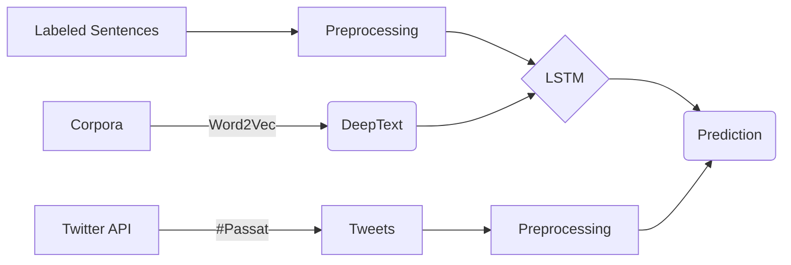

# Konum Bazlı Müşteri Memnuniyeti

Bu proje Wolkswagen'in yeni Passat modelinin konum bazlı müşteri memnuniyetini twitter üzerinden hesaplamaktadır. Projenin genel işleyişini aşağıdaki diyagram ile gösterebiliriz;

# Etiketlenmiş Cümlelerin Hazırlanması

IMDB ve Stanford'ın olumlu ve olumsuz olarak etiketlenmiş verileri eğitim için indirilir. Bu sayede tweetlerin olumlu ya da olumsuz olduğu tahmin edilir. İndirilen bu veriler ingilizce olması analizi yapılacak cümlelerin de normal şartlarda ingilizce olmasını gerektirmektedir. Bu sorunu aşmak için birden fazla dile ait sözcüklerin tek bir dil gibi davranmasını sağlanayaktır. 

## Preprocessing
Programın daha başarılı bir şekilde çalışması için metinler ön hazırlık aşamasından geçirilmelidirler. Bu aşamalar şöyle gösterilebilir;

- Kelimelerin hepsinin küçük harfe çevrilmesi
- Gereksiz karakterlerin çıkarılması
- Cümleye anlam olarak bir katkısı olmayan is, are gibi sözcüklerin çıkarılması
> Bu kriterler isteğe göre daha da arttırılabilir.

# Kelime Vektörlerinin Hazırlanması

Wikipedia Dump'ından bir den fazla dile ait metinler ayrı ayrı indirilmelidir. Her dil için oluşturulan bu Corpora'lar ayrı olarak **Word2Vec** derin öğrenme algoritması ile eğitilir ve böylece her bir sözcük için 200 boyutlu bir vektör elde edilmiş olur. Bu vektörler sözcüklerin anlamını ifade eder. Fakat etiketlenmiş cümlelerimiz ingilizce olduğu için diğer dillere ait vektörlerimiz ile aynı uzayda olmayacağı için tek bir dil desteğimiz olmuş olur. Bu sorunu **DeepText** algoritmasını kullanarak aşabiliriz.

> Yukarıda gösterildiği gibi birden fazla dile ait metinler eğitilerek vektörleri elde edildikten sonra tek bir dilmiş gibi ifade edilmesini sağlaması için aynı uzayda ifade edilir. Böylece hem birden fazla dilde tweet analiz edilebilir ve hangi dilde yazıldığını bulmamıza gerek kalmaz.

# Twitter'dan Verilerinin Hazırlanması

Twitter API'den son 3 aya ait #Passat hastagli tweetler indirilir ve bu verilerde konum 
bilgisi de yer almalıdır. 

> Etiketlenmiş verilerin Preprocessing aşaması bire bir burada da uygulanır. 

# LSTM Modelinin Oluşturulması

LSTM(Long-Short Term Memory) derin öğrenme algoritması sayesinde tahminde bulunulacaktır. Bu algoritma için gerekli olanlar etiketlenmiş veriler ve bu verilerin anlamını gösteren vektörlerdir. 

# Tweet Analizi
Eğitilen model sayesinde tüm tweetler olumlu veya olumsuz diye etiketlenir ve belirli alanlara göre müşterilerin memnuniyeti yüzde olarak hesaplanabilir.

> Başarı hesabı yapılması için eğitime dahil edilmeyen gerçek ve kendimiz tarafından etiketlenmiş tweetler kullanılır. Böylece sistemin yüzde olarak başarısı ölçülür. 
